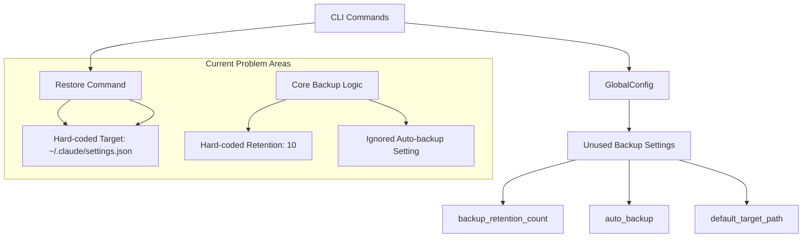
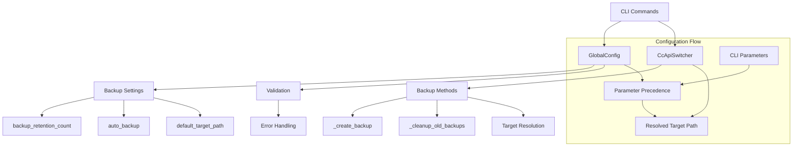

# integrate-backup-global-config Design

## Architecture Overview

This design addresses two critical issues in the backup system by integrating GlobalConfig throughout the backup and restore workflow. The solution follows existing patterns established in the `switch` command to ensure consistency.

## Current State Analysis

### Problems Identified
1. **CLI Commands Don't Use GlobalConfig**: `backup` and `restore` commands instantiate `CcApiSwitcher` without passing `GlobalConfig`, ignoring user-configured default targets
2. **Hard-coded Backup Settings**: `CcApiSwitcher` hard-codes backup retention to 10 and ignores auto-backup toggle
3. **Missing Configuration Integration**: GlobalConfig exposes backup settings but core logic never uses them

### Current Architecture Gaps


## Solution Design

### 1. Enhanced CcApiSwitcher Integration

**Constructor Changes**
```python
class CcApiSwitcher:
    def __init__(
        self,
        target_path: Optional[Path] = None,
        backup_dir: Optional[Path] = None,
        global_config=None,  # Existing parameter, now fully utilized
    ):
        self.global_config = global_config

        # Use global config for default target if provided
        if global_config and not target_path:
            self.target_path = global_config.get_default_target_path()
        else:
            self.target_path = target_path or get_default_target_path()
```

**Backup Settings Integration**
```python
def _get_backup_retention_count(self) -> int:
    """Get backup retention count from config or fallback to default."""
    if self.global_config:
        return self.global_config.get_backup_retention_count()
    return 10  # Default fallback

def _is_auto_backup_enabled(self) -> bool:
    """Check if auto-backup is enabled."""
    if self.global_config:
        return self.global_config.is_auto_backup_enabled()
    return True  # Default fallback
```

**Updated Backup Methods**
```python
def _cleanup_old_backups(self) -> None:
    """Remove old backups using configured retention count."""
    retention_count = self._get_backup_retention_count()
    backup_pattern = f"{self.target_path.name}.backup.*"
    backups = sorted(
        self.backup_dir.glob(backup_pattern),
        key=lambda p: p.stat().st_mtime,
        reverse=True,
    )

    for old_backup in backups[retention_count:]:
        try:
            old_backup.unlink()
        except Exception:
            pass
```

### 2. CLI Command Integration Pattern

**Following Switch Command Pattern**
```python
@app.command("backup")
def create_backup(target: Optional[Path] = None) -> None:
    """Create a manual backup of current settings."""
    try:
        # Initialize global configuration (pattern from switch command)
        global_config = GlobalConfig()

        # Resolve target using GlobalConfig if not provided
        if not target:
            target = global_config.get_default_target_path()

        # Pass GlobalConfig to CcApiSwitcher
        switcher = CcApiSwitcher(target_path=target, global_config=global_config)

        # Rest of command logic...
```

### 3. Configuration Precedence Logic

**Parameter Precedence Chain**
1. **CLI Parameters** (`--target`) - Highest precedence
2. **GlobalConfig Settings** (`default_target_path`) - Middle precedence
3. **System Defaults** (`~/.claude/settings.json`) - Lowest precedence

**Implementation Strategy**
```python
def resolve_target_path(cli_target: Optional[Path], global_config: GlobalConfig) -> Path:
    """Resolve target path using proper precedence."""
    if cli_target:
        return cli_target  # CLI parameter takes precedence

    if global_config:
        return global_config.get_default_target_path()  # Use configured default

    return get_default_target_path()  # Fall back to system default
```

### 4. Error Handling and Validation

**Configuration Validation**
```python
def validate_backup_settings(global_config: GlobalConfig) -> None:
    """Validate backup configuration and provide warnings for invalid settings."""
    retention = global_config.get_backup_retention_count()

    if retention <= 0:
        logger.warning(f"Invalid backup_retention_count: {retention}. Using default of 10.")
        # Configuration migration logic could go here

    target_path = global_config.get_default_target_path()
    if not target_path.parent.exists():
        logger.warning(f"Target parent directory does not exist: {target_path.parent}")
```

**Graceful Error Handling**
```python
try:
    global_config = GlobalConfig()
except GlobalConfigError as e:
    console.print(f"[red]Configuration error: {e}[/red]")
    console.print("[dim]Run 'cc-api-switch init' to set up configuration[/dim]")
    console.print("[dim]Or use --target parameter to specify target explicitly[/dim]")
    raise typer.Exit(1)
```

## Implementation Architecture

### Component Interactions



### Data Flow

1. **Command Initiation**
   - CLI command receives optional parameters
   - GlobalConfig is initialized and validated
   - Target path is resolved using precedence logic

2. **CcApiSwitcher Initialization**
   - GlobalConfig instance is passed to constructor
   - Backup settings are extracted and cached
   - Target path is resolved and validated

3. **Backup Operations**
   - Backup methods use configured retention counts
   - Auto-backup settings are respected
   - Cleanup follows user-specified limits

## Migration and Compatibility

### Backward Compatibility
- **Existing API**: `CcApiSwitcher(target_path)` continues to work
- **Default Behavior**: Unconfigured systems use existing defaults
- **CLI Interface**: Existing parameter behavior unchanged
- **Configuration**: Missing settings populated with safe defaults

### Migration Path
1. **Phase 1**: Core integration without breaking existing code
2. **Phase 2**: CLI command updates with GlobalConfig support
3. **Phase 3**: Enhanced validation and error handling
4. **Phase 4**: Documentation and help text updates

## Testing Strategy

### Unit Testing
- **CcApiSwitcher Integration**: Test with/without GlobalConfig
- **Configuration Precedence**: Verify parameter override behavior
- **Backup Logic**: Test retention count and auto-backup toggle
- **Error Handling**: Test validation and graceful failures

### Integration Testing
- **CLI Commands**: Test backup/restore with various configurations
- **End-to-End Workflows**: Test complete backup/restore cycles
- **Configuration Scenarios**: Test migration and upgrade paths
- **Error Recovery**: Test user guidance and recovery procedures

### Manual Testing
- **User Scenarios**: Test real-world usage patterns
- **Configuration Edge Cases**: Test unusual but valid configurations
- **Error Messages**: Verify clarity and actionability
- **Performance**: Ensure no regression in backup speed

## Risks and Mitigations

### Technical Risks
- **Configuration Corruption**: Invalid settings could break backups
  - **Mitigation**: Validation and safe fallbacks
- **Breaking Changes**: Existing code might depend on current behavior
  - **Mitigation**: Maintain full backward compatibility
- **Complexity**: Adding configuration logic increases complexity
  - **Mitigation**: Follow established patterns and clear documentation

### User Experience Risks
- **Confusion**: New configuration options might confuse users
  - **Mitigation**: Clear help text and migration guidance
- **Migration Issues**: Existing users might face configuration problems
  - **Mitigation**: Automatic migration with sensible defaults
- **Error Messages**: Poor error messages could frustrate users
  - **Mitigation**: Actionable error messages with clear guidance

This design ensures comprehensive GlobalConfig integration while maintaining backward compatibility and providing a robust, user-friendly backup system.